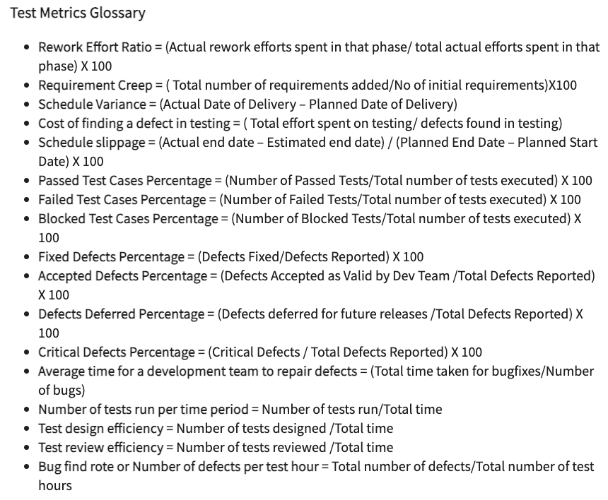

# ISTQB Framework

## Core Foundation
### ISTQB-CTFL(ISTQB Certified Tester Foundation Level)
- Fundamentals of Testing
  - What is Testing?
  - Why is Testing Necessary?
  - Seven Testing Principles
    - Testing shows the presence of defects, not their absence
    - Exhaustive testing is impossible
    - Early testing saves time and money
    - Defects cluster together
    - Beware of the pesticide paradox
    - Testing is context dependent
    - Absence-of-errors is a fallacy
  - Test Activities, Testware and Test Roles
  - Essential Skills and Good Practice for Testing
    - Plan the testing SMART(Specific, Measurable, Attainable, Relevant, Time-bound)
    - Integrate testing in the development stage("shift-left":test early and often, TDD, BDD, Agile)
  
    - Use test-oriented development practices(Pair Programming, TDD, CI/CD)
    - Adequate reporting of testing progress and results
    - Comprehensive testing coverage
    - Test on real devices
    - Testing metrics practice(Process metrics, Product metrics, Project metrics)
  
    - Distributing tasks according to the team members' skills
    - Testing one feature per case
    - Provide Version-Call(Rollback) option
- Testing Throughout the Software Development Lifecycle
- Static Techniques (Dynamic Techniques: Functional/Performance/Security Testing)
  - Code Reviews
  - Requirements Reviews
  - Design Reviews
  - User Story Reviews
  - Test Plan Reviews
  - Test Case Reviews
- Test Analysis and Design
- Managing the Test Activities
- Test Tools and Automation

## Core Advanced
### ISTQB-CTAL-TA(ISTQB Certified Tester Advanced Level - Test Analyst)
- The Test Analyst's Tasks in the Test Process
  - Introduction
  - Test in the Software Development Lifecycle
  - Test Analysis
  - Test Design
    - Test Design Techniques
      - Specification-based or Black-box Techniques
        - Equivalence Partitioning
        - Boundary Value Analysis
        - Decision Table Testing
        - State Transition Testing
        - Use Case Testing
        - Classification Tree Method
        - Pairwise Testing
        - Domain Analysis
      - Structure-based or White-box Techniques
        - Statement Testing and Coverage
        - Decision Testing and Coverage
        - Condition Testing and Coverage
        - Multiple Condition Testing and Coverage
        - Modified Condition/Decision Coverage
        - Path Testing
        - LCSAJ Testing
        - Data Flow Testing
        - Loop Testing
        - State Testing
        - Domain Testing
      - Experience-based Techniques
        - Error Guessing
        - Exploratory Testing
        - Checklist-based Testing
  - Test Implementation
  - Test Execution
- The Test Analyst's Tasks in Risk-Based Testing
  - Introduction
  - Risk Identification
  - Risk Assessment
  - Risk Mitigation
- Testing Techniques
  - Introduction
  - Specification-based or Black-box Techniques
  - Structure-based or White-box Techniques
  - Experience-based Techniques
  - Applying Techniques in Practice
- Testing Software Quality Characteristics
  - Introduction
  - Quality Characteristics for Business Domain Testing
- Reviews
  - Introduction
  - Using Checklists in Reviews
- Test Tools and Automation
  - Automation Pyramid
    - Unit Test
    - Integration Test
    - End-to-End Test
  - Automation Framework
    - Data-Driven Testing
    - Keyword-Driven Testing
    - Modular Testing
    - Hybrid Testing
### ISTQB-CTAL-TM(ISTQB Certified Tester Advanced Level - Test Manager)
- Testing Process
  - Test Planning
  - Test Monitoring and Control
  - Test Analysis
  - Test Design
  - Test Implementation
  - Test Execution
  - Evaluating Exit Criteria and Reporting
  - Test Closure Activities
- Test Management
  - Test Management in Context
  - Risk-based Testing and Other Approaches for Test Prioritization and Effort Allocation
  - Test Documentation and Other Work Products
  - Test Estimation
  - Defining and Using Test Metrics
  - Business Value of Testing
  - Distributed, Outsourced and Insourced Testing
  - Managing the Application of Industry Standards
- Reviews
  - Management Reviews and Audits
  - Managing Reviews
  - Metrics for Reviews
  - Managing Formal Reviews
- Defect Management
  - Defect Lifecycle and the Software Development Lifecycle
  - Defect Report Information
  - Assessing Process Capability with Defect Report Information
- Improving the Testing Process
  - Improving the Testing Process
  - Improving the Testing Process with TMMi
- Test Tools and Automation
  - Tool Selection
  - Tool Lifecycle
  - Tool Metrics
- People Skills - Team Composition
  - Team Composition
  - Individual Skills and Competencies
  - Team Dynamics
  - Motivation and De-motivation
  - Communication
  - Managing Conflict
  - Fostering Collaboration
  - Training and Mentoring
  - Individual Skills and Competencies
  - Team Dynamics
  - Motivation and De-motivation
  - Communication
  - Managing Conflict
  - Fostering Collaboration
  - Training and Mentoring
### ISTQB-CTAL-TTA(ISTQB Certified Tester Advanced Level - Technical Test Analyst)
- The Technical Test Analyst's Tasks in Risk-Based Testing
  - Introduction
  - Risk-based Testing Tasks
- White-Box Test Techniques
  - Introduction
  - Statement Testing
  - Decision Testing
  - Modified Condition/Decision Coverage Testing
  - Multiple Condition Testing
  - API Testing
  - Selecting White-box Test Techniques
- Static and Dynamic Analysis
  - Introduction
  - Static Analysis by Tools
  - Dynamic Analysis by Tools
  - Static and Dynamic Analysis in Practice
- Quality Characteristics for Technical Testing
  - General Planning Issues
  - Security Testing
  - Reliability Testing
  - Performance Testing
  - Maintainability Testing
  - Portability Testing
  - Compatibility Testing
  - Operational Testing
- Reviews
  - Technical Test Analyst's Tasks in Reviews
  - Using Checklists in Reviews
- Test Tools and Automation
  - Defining the Test Automation Project
  - Specific Test Tools
## Specialist
### ISTQB-CTAL-SEC(ISTQB Certified Tester Advanced Level - Security Tester)
### ISTQB-CTAL-AT(ISTQB Certified Tester Advanced Level - Agile Tester)
### ISTQB-CTAL-MT(ISTQB Certified Tester Advanced Level - Model-Based Tester)
### ISTQB-CTAL-Performance(ISTQB Certified Tester Advanced Level - Performance Testing)
### ISTQB-CTAL-Test Automation Engineer(ISTQB Certified Tester Advanced Level - Test Automation Engineer)
### ISTQB-CT-AI(ISTQB Certified - AI Testing)

## Expert
### ISTQB-CTEL(ISTQB Certified Tester Expert Level)

## Agile
### ISTQB-CTFL-AT(ISTQB Certified Tester Foundation Level - Agile Tester)
### ISTQB-CTAL-AT(ISTQB Certified Tester Advanced Level - Agile Tester)
### ISTQB-CTAL-ATTA(ISTQB Certified Tester Advanced Level - Agile Technical Tester)